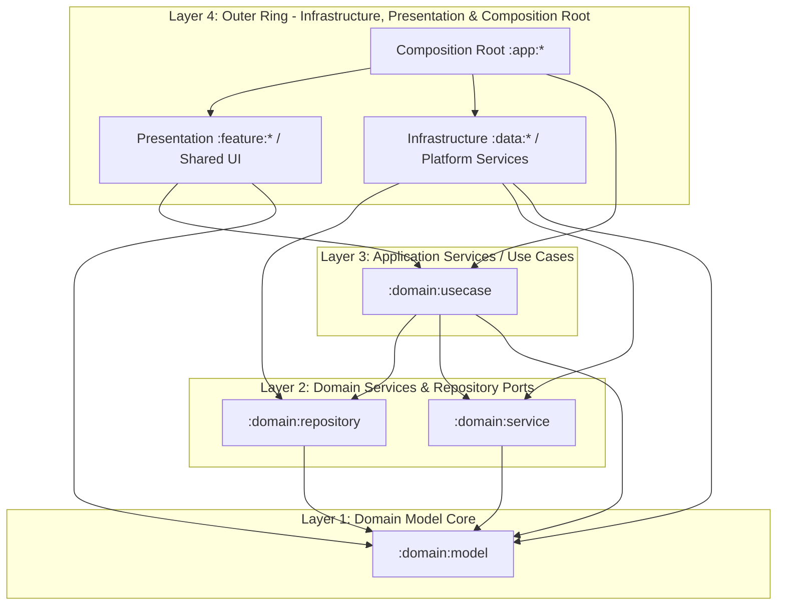

# オニオンアーキテクチャ完全準拠に向けたリファクタリング計画書
(Onion Architecture Refactoring Plan)

## 1. 概要と進捗サマリー

ComicViewer はマルチプラットフォーム（Android, JVM, iOS）に対応したコミックビューアアプリであり、保守性とテスタビリティの最大化を目的として **オニオンアーキテクチャ (Onion Architecture)** の導入を進めています。

これまでのリファクタリングにより、最もクリティカルであったドメイン層の外部依存やレイヤー逆転（WorkManager のデータ層同居、UI のフレームワーク層配置など）は解消されました。本書は、現在の対応状況を整理し、残存する課題とその段階的な解決計画を明確に定義するものです。

### 全体進捗ステータス一覧

| 区分 | 課題項目 | 対象モジュール | ステータス | 影響度 |
| :--- | :--- | :--- | :---: | :---: |
| **完了** | ドメイン層による Framework 層への逆依存 | `:domain:*` / `:framework:common` | **【解決済み】** | 重大 |
| **完了** | Infrastructure層 (`data:sync`) の Application 逆依存 | `:data:sync` → `:app:sync` | **【解決済み】** | 重大 |
| **完了** | Presentation層の Framework 配置 | `:framework:ui:file` → `:feature:file` | **【解決済み】** | 重大 |
| **完了** | Infrastructure層同士 (`data:coil` → `data:storage`) の具象結合 | `:data:coil`, `:data:storage` | **【解決済み】** (PR #1420) | 高 |
| **完了** | `feature:file:nav` による実装モジュール抱え込み | `:feature:file:nav`, `:feature:file` | **【解決済み】** (PR #1423) | 中 |
| **完了** | `feature:settings` による子画面実装モジュールへの直接依存 | `:feature:settings:*` | **【解決済み】** | 中 |
| **残課題** | ドメイン層ポートの型安全性喪失 (`Deferred<Any>`) | `:domain:repository`, `:domain:service` | **【未着手】** | 中 |
| **残課題** | `framework:permission` における UI 画面の混在 | `:framework:permission` | **【未着手】** | 軽微 |
| **継続** | `README.md` アーキテクチャ図・モジュール一覧の同期 | `README.md` | **【継続対応】** | - |

---

## 2. オニオンアーキテクチャの基本原則とルール



### 絶対遵守すべきルール
1. **依存は常に中心（Domain Model）へ向かう (Dependencies Point Inward):**
   - 外側の層（Infrastructure, Presentation, Framework, App）は内側の層に依存してよい。
   - **内側の層（Domain Model, Domain Services, Repository Ports, Use Cases）は外側の層に一切依存してはならない。**
2. **ドメイン層の純粋性の担保:**
   - `:domain:*` モジュールは、言語標準ライブラリおよびプラットフォーム非依存の最小限のプリミティブ（日付、シリアライズ等）以外のフレームワーク/プラットフォーム依存を持ってはならない。
3. **ポート＆アダプター（DIP）の徹底:**
   - 外部との入出力（DB、ファイルストレージ、画像キャッシュ、OS通知、バックグラウンド処理）は、ドメイン層でインターフェース（ポート）として定義し、外側の層で具象（アダプター）を実装する。
   - 外側の層同士（例: `data:coil` と `data:storage`）が直接具象結合してはならず、ドメインポート経由で協調する。
4. **Presentation層モジュール間の直接結合禁止:**
   - Feature 画面モジュール同士は直接依存せず、`:*.nav` モジュール経由で NavKey を使った画面遷移を行う。
   - `:*.nav` モジュールは純粋な画面遷移キーのみを保持し、画面実装（コンポーザブル）に依存してはならない。

---

## 3. 対応完了済みリファクタリング（実績）

### 【解決済み】実績1: ドメイン層（Core）による外部 Framework 層への逆依存の解消
- **実施内容:**
  1. `build-logic/src/main/kotlin/comicviewer/convention/multiplatform-library.gradle.kts` を改修し、`!project.path.startsWith(":domain")` の除外条件を追加。これにより `:domain:*` モジュールへの `:framework:common` 自動注入を完全に遮断。
  2. コルーチンディスパッチャ用の Qualifier アノテーション `@IoDispatcher` を `com.sorrowblue.comicviewer.domain.model.common.IoDispatcher` としてドメイン層内に再定義。
  3. ドメイン層内部で使用する最小限のロギング機構（プラットフォーム非依存の `logcat` 実装）を `:domain:model` に内包。
- **成果:**
  `:domain:model`, `:domain:repository`, `:domain:service`, `:domain:usecase` の全ドメイン層から `com.sorrowblue.comicviewer.framework.*` への依存がゼロになり、純粋な Core 層が確立されました。

### 【解決済み】実績2: Infrastructure層 (`data:sync`) による Application層 (`domain:usecase`) の逆依存と責務混同の解消
- **実施内容:**
  1. WorkManager の CoroutineWorker（Inbound Adapter）およびプラットフォーム固有の `BookshelfScanManager` 実装を含んでいた `:data:sync` を、Application / Platform レイヤーの独立モジュール `:app:sync` に移行・再配置。
  2. `settings.gradle.kts` から `:data:sync` を削除し、`:app:sync` を登録。
- **成果:**
  `data` (Infrastructure) レイヤー全体から `:domain:usecase` への逆依存が 100% 解消されました。「UseCase → Data(ScanManager) → Data(Worker) → UseCase」という循環的な責務のねじれが排除されました。

### 【解決済み】実績3: Presentation層が `framework:ui:file` として Framework 層に配置されていた問題の解消
- **実施内容:**
  1. 画面コンポーザブル（`FileInfoScreen`）と ViewModel（`FileInfoViewModel`）を抱えていた `:framework:ui:file` を廃止。
  2. Presentation 層として `:feature:file` および画面遷移用モジュール `:feature:file:nav` を新設して移行。
- **成果:**
  Framework 層が UseCase に依存して画面を提供するというレイヤー崩壊が解消され、他の Feature と同様に Presentation 層として適切な位置に収まりました。

### 【解決済み】実績4: Infrastructure層同士 (`data:coil` → `data:storage`) の具象結合と DIP 違反の解消 (PR #1420)
- **実施内容:**
  1. ドメイン層（`:domain:repository`）に本ファイル読み取り用の抽象ポート `BookFileReader` を新設し、`BookFileReaderManager.get` および `RemoteStorageClient.fileReader` を追加。
  2. `BookFileReaderManagerImpl` から不要となった `@ExposeImplBinding` を削除し、Metro DI における具象露出をカプセル化。
  3. `BookPageImageFetcher` をドメインポート `BookFileReaderManager` 依存へ、`BookThumbnailFetcher` を `RemoteStorageClient.fileReader` 利用へリファクタリング。
  4. `data/coil/build.gradle.kts` から `implementation(projects.data.storage)` を完全削除。
- **成果:**
  Infrastructure 層同士の横断的な具象結合が排除され、ドメインポートを介した疎結合な依存性逆転（DIP）が確立されました。

### 【解決済み】実績5: `feature:file:nav` による画面実装抱え込みの解消と DI 自動収集 (PR #1423)
- **実施内容:**
  1. `FileInfoNavKey` を純粋なインターフェース化し、`feature/file/nav/build.gradle.kts` から画面実装（コンポーザブルや ViewModel）の依存を完全に除去。
  2. KSP（`NavKeyProcessor`）を拡張し、`FileInfoNavKey` の具象クラスを Metro の `@ElementsIntoSet` として自動登録・集約するコード生成機構を導入。
  3. `:feature:file` 側で注入された `Set<FileInfoNavKey>` を用いて `scope.entry<T>` を一括登録する設計を確立。
- **成果:**
  画面遷移用ナビゲーションモジュール（`:feature:file:nav`）が具象実装モジュールから完全に分離され、各画面モジュール（folder, history, search 等）が独自に `FileInfoNavKey` 実装を提供できる疎結合なアーキテクチャが完成しました。

### 【解決済み】実績6: `feature:settings` の子画面実装モジュール直接依存解消と DIP 確立
- **実施内容:**
  1. 各設定サブ画面のメイン NavKey（Display, Folder, Viewer, Security, Extension, Info）を共通ナビゲーションモジュール `:feature:settings:nav` に集約。
  2. `feature:settings:common` に `SettingsDetailPlaceholder` ポートを定義し、`feature:settings:display` 側で `@ContributesBinding(AppScope::class)` で具象実装。
  3. KSP プロセッサ（`NavKeyProcessor`）を拡張し、`@NavigationEntry` 関数に `Navigator` 以外の追加引数がある場合、生成される `XxxNavEntry` の `@Inject` コンストラクタ引数として自動注入する機構を導入。
  4. `settingsNavEntry` は引数として `SettingsDetailPlaceholder` を直接受け取り、2ペイン詳細プレースホルダーとして描画。
  5. `feature/settings/build.gradle.kts` から、子画面実装モジュール 6 件（display, folder, info, security, extension, viewer）への依存を完全削除。
- **成果:**
  - `feature:settings` は純粋な NavKey と共通プレースホルダーポートのみに依存し、子画面実装モジュールへの直接依存が 100% 排除されました。
  - KSP による DI コンストラクタ自動注入により、Compose 内での CompositionLocal やサービスロケータに頼ることなく、純粋なコンストラクタ注入（Metro DI）による疎結合な画面登録が確立されました。

---

## 4. 残存する課題と詳細分析

### 【残課題1 / 影響度: 中】ドメイン層インターフェースにおける型安全性の喪失・抽象の漏れ
- **問題の箇所:**
  - `domain:repository.ThumbnailRepository`:
    ```kotlin
    interface ThumbnailRepository {
        fun load(fileThumbnail: FileThumbnail): Deferred<Any>
    }
    ```
    戻り値が `Deferred<Any>` となっており、Coil の実装都合（`ImageResult` 等）を隠蔽しようとした結果、型安全性が完全に失われている。
  - `domain:service.file.FileSortService`:
    - Android 側実装で `android.icu.text.Collator`、JVM 側で `java.text.Collator` を直接使用している。
- **解決方針:**
  1. `ThumbnailRepository` の戻り値をドメイン層で意味のある型（`Deferred<ThumbnailResult>` や成功/失敗を表すドメインモデル）に定義し直す。
  2. ソート処理については、純粋なドメイン要件とプラットフォーム固有の照合順序（Collator）の責務境界を整理する。

---

### 【完了】`framework:permission` にプレゼンテーション層（Compose UI画面）が混在していた問題の解消
- **問題の箇所:**
  - `framework/permission/` 内にパーミッション説明用 UI（Screen / Content / Resources）が混在していた。
- **解決方針 & 対応内容:**
  - 独立した Feature モジュール `:feature:permission` および `:feature:permission:nav` を新設。
  - `LocalNetworkAccessPermissionNavKey` によるダイアログ NavEntry（`DialogSceneStrategy.dialog()`）として画面遷移化。
  - `:framework:permission` から UI / DesignSystem / Resources を全削除し、純粋な Infrastructure（プラットフォーム権限リクエスター基盤）に純化。

---

## 5. 今後のリファクタリング計画（ロードマップ）

### 【完了】フェーズ 1: Infrastructure層の疎結合化（ポート＆アダプターの徹底）
最外層である Infrastructure 同士の直接結合を解消し、DIP を確立しました（PR #1420）。

---

### 【完了】フェーズ 2: Feature層の疎結合化（Navigation 規約の完全徹底）
Feature 画面間の直接依存と推移的依存を完全に排除しました。

1. **【完了】`feature:file:nav` の純粋化 (PR #1423):**
   - `FileInfoNavKey` を純粋なインターフェース化し、`feature/file/nav/build.gradle.kts` から画面実装依存を除去。
   - KSP（`NavKeyProcessor`）による `FileInfoNavKey` の DI 自動収集および `:feature:file` でのエントリ一括登録を確立。
2. **【完了】`feature:settings` の疎結合化:**
   - 設定各サブ画面の NavKey を `:feature:settings:nav` へ集約。
   - `feature/settings/build.gradle.kts` から各子画面モジュールへの直接依存を排除。
   - 2ペイン詳細プレースホルダーを `SettingsDetailPlaceholder` ポート経由で Metro DI 解決。

---

### 【対応中】フェーズ 3: ドメイン層・Framework層の境界整備
インターフェースの型安全性を向上させ、Framework 内の UI 混在を解消します。

1. **`ThumbnailRepository` の型安全性改善:**
   - `Deferred<Any>` をドメイン固有のモデル（または明確な画像表現型）にリファクタリング。
2. **【完了】`framework:permission` の UI 分離 & NavEntry 化:**
   - `feature:permission` および `feature:permission:nav` を新設し、NavEntry として登録・画面遷移化。
   - `framework:permission` を純粋なパーミッションハンドラーライブラリとして純化。
3. **検証:**
   - `./gradlew :feature:permission:build :framework:permission:build`

---

### フェーズ 4: ドキュメント同期と最終品質ゲート
コードの変更に合わせて SSoT となるドキュメントを同期し、全品質ゲートをパスさせます。

1. **`README.md` の更新:**
   - Mermaid 依存関係図を修正（`:feature:file` の明記、`:data:coil` → `:data:storage` 依存の完全除去の反映）。
   - モジュール一覧表のレイヤー分類・説明を最新化。
2. **全品質ゲートの実行:**
   - Detekt, Lint, 全テスト, 全ビルドのパスを確認。

---

## 6. 検証およびテスト計画

各フェーズの実行時は、以下のコマンド群を順次実行してリグレッションを防ぎます。

```bash
# 1. コードフォーマットの自動適用
./gradlew detektFormat

# 2. 静的コード解析（全プラットフォーム）
./gradlew reportMerge

# 3. Android Lint チェック
./gradlew :app:androidApp:lintDebug

# 4. 単体テストの実行（全モジュール）
./gradlew allTests

# 5. アプリケーションのビルド検証
./gradlew :app:androidApp:assembleDebug
./gradlew :app:jvmApp:packageDistributionForCurrentOS
```
