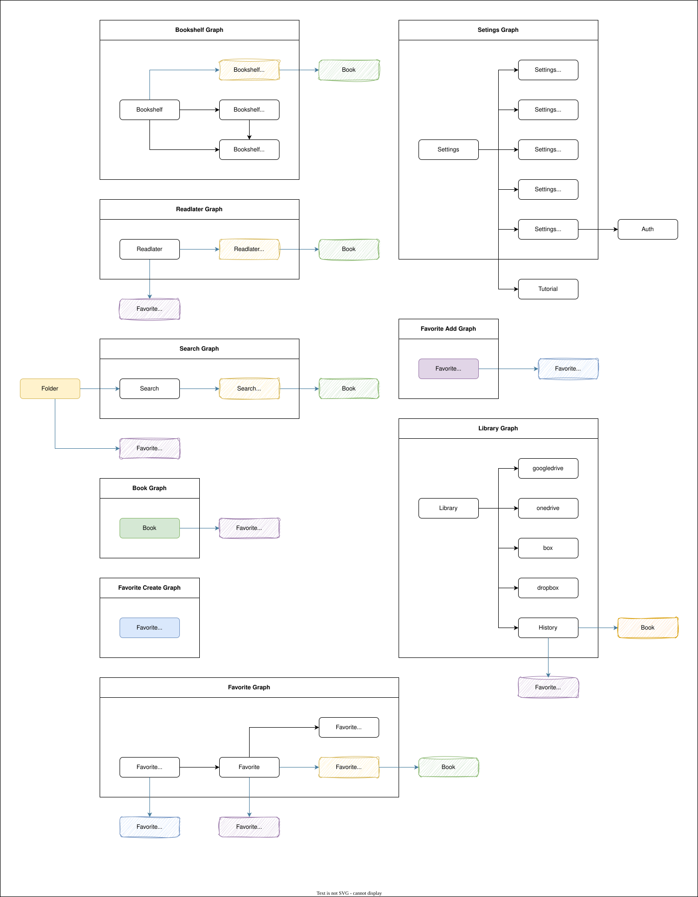

# ComicViewer

## Developer Guide

**For comprehensive development guidelines, please refer to [AGENTS.md](AGENTS.md)**

AGENTS.md contains detailed information about:

- Project setup and environment configuration
- Build and test commands with execution time estimates
- Code style guidelines and best practices
- Architecture and module structure
- Pull Request policies and release process

## Release Automation

ComicViewer uses automated GitHub Actions workflows for releases.
See [docs/release-automation.md](docs/release-automation.md) for details on the automated release
process that builds and deploys both Android and JVM versions.

## Coding rules

Follow Android's [Kotlin style guide](https://developer.android.com/kotlin/style-guide).
Also, use [trailing comma](https://kotlinlang.org/docs/coding-conventions.html#trailing-commas).

Use [detekt](https://github.com/detekt/detekt) as a static code analysis tool.

## Plugin configuration

<link
  href="https://cdnjs.cloudflare.com/ajax/libs/font-awesome/6.5.1/css/all.min.css"
  rel="stylesheet"
/>

```mermaid
---
title: Plugin configuration
---
graph LR
    DetektConventionPlugin
    DokkaConventionPlugin

    KotlinMultiplatformApplicationConventionPlugin --> AndroidLintConventionPlugin
    KotlinMultiplatformApplicationConventionPlugin --> DetektConventionPlugin

    MultiplatformLibraryConventionPlugin --> AndroidLintConventionPlugin
    MultiplatformLibraryConventionPlugin --> DetektConventionPlugin

    MultiplatformComposeConventionPlugin --> DetektConventionPlugin

    DiConventionPlugin

    KotlinMultiplatformFeatureConventionPlugin --> MultiplatformLibraryConventionPlugin
    KotlinMultiplatformFeatureConventionPlugin --> MultiplatformComposeConventionPlugin
    KotlinMultiplatformFeatureConventionPlugin --> DiConventionPlugin
## Module configuration

| Module  |                |              | Overview               |
|---------|----------------|--------------|------------------------|
| app     | androidApp     |              | Android Application |
| app     | androidBenchmark|             | Android Benchmark Module |
| app     | jvmApp         |              | JVM (Desktop) Application |
| app     | ios            |              | iOS Application |
| app     | share          |              | Platform shared entry point |
| domain  | model          |              | Domain models and entities |
| domain  | service        |              | Domain service definitions |
| domain  | usecase        |              | Usecase implementations |
| data    | coil           |              | Thumbnail and image loading implementations |
| data    | database       |              | Room database implementations |
| data    | datastore      |              | Datastore for settings and status persistence |
| data    | reader         | document     | PDF/Document file reader implementations |
| data    | reader         | zip          | ZIP/Archive file reader implementations |
| data    | storage        |              | File storage client abstractions |
| data    | storage        | device       | Local device storage implementations |
| data    | storage        | smb          | SMB network storage implementations |
| feature | authentication |              | Login/Authentication screen |
| feature | book           |              | Comic viewer screen |
| feature | book           | nav          | Comic viewer navigation |
| feature | bookshelf      |              | Bookshelf/Library screen |
| feature | bookshelf      | edit         | Bookshelf editing screen |
| feature | bookshelf      | info         | Bookshelf information screen |
| feature | collection      |              | Collection screen |
| feature | collection      | add          | Add collection screen |
| feature | collection      | editor       | Edit collection screen |
| feature | collection      | nav          | Collection navigation |
| feature | file           |              | File browser and management screen |
| feature | folder         |              | Folder navigation screen |
| feature | history        |              | Reading history screen |
| feature | readlater      |              | Read later screen |
| feature | search         |              | Search and discovery screen |
| feature | settings       |              | Settings top screen |
| feature | settings       | common       | Common settings definitions |
| feature | settings       | extension    | Extension settings screen |
| feature | settings       | display      | Display/UI settings screen |
| feature | settings       | folder       | Folder settings screen |
| feature | settings       | info         | Application information screen |
| feature | settings       | nav          | Settings navigation |
| feature | settings       | security     | Security settings screen |
| feature | settings       | viewer       | Viewer settings screen |
| feature | tutorial       |              | User onboarding screen |
| framework| common        |              | Common utilities |
| framework| background    |              | Background task processing implementations |
| framework| designsystem  |              | Design system components |
| framework| notification  |              | Notification processing implementations |
| framework| permission    |              | Permission management implementations |
| framework| test          |              | Testing utilities |
| framework| ui            |              | Shared UI components |
| framework| navkey-processor|            | Navigation key processor |

## Module dependencies

```mermaid
graph TD
    subgraph app [app]
        :app:androidApp --> :app:share
        :app:jvmApp --> :app:share
        :app:ios --> :app:share
    end

    subgraph feature [feature]
        :feature:book --> :feature:book:nav
        :feature:bookshelf --> :feature:bookshelf:edit
        :feature:bookshelf --> :feature:bookshelf:info
        :feature:collection --> :feature:collection:add
        :feature:collection --> :feature:collection:editor
        :feature:collection --> :feature:collection:nav
        :feature:settings --> :feature:settings:common
        :feature:settings --> :feature:settings:nav
        :feature:settings:display --> :feature:settings:common
        :feature:settings:folder --> :feature:settings:common
        :feature:settings:info --> :feature:settings:common
        :feature:settings:security --> :feature:settings:common
        :feature:settings:viewer --> :feature:settings:common
        :feature:settings:extension --> :feature:settings:common
    end

    subgraph domain [domain]
        :domain:usecase --> :domain:model
        :domain:service --> :domain:model
        :domain:usecase --> :domain:service
    end

    subgraph data [data]
        :data:coil --> :domain:service
        :data:database --> :domain:model
        :data:datastore --> :domain:model
        :data:reader:document --> :data:storage
        :data:reader:zip --> :data:storage
        :data:storage:device --> :data:storage
        :data:storage:smb --> :data:storage
        :data:storage --> :domain:service
    end

    subgraph framework [framework]
        :framework:ui --> :framework:designsystem
        :framework:ui --> :framework:common
    end

    :app:share --> feature
    feature --> domain
    feature --> framework
    data --> domain
    domain --> framework
```

## Screen transition diagram

