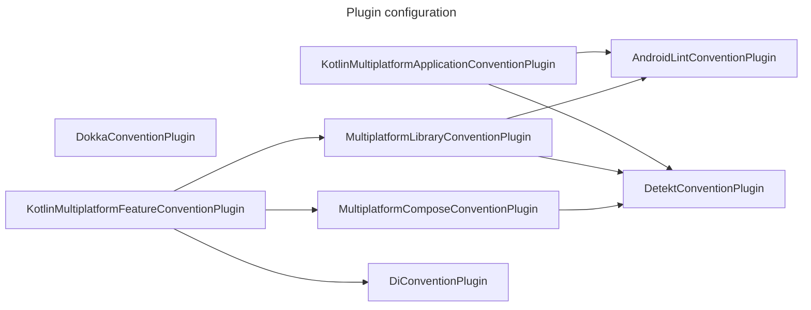

# ComicViewer

## Developer Guide

📘 **For comprehensive development guidelines, please refer to [AGENTS.md](AGENTS.md)**

AGENTS.md contains detailed information about:
- Project setup and environment configuration
- Build and test commands with execution time estimates
- Code style guidelines and best practices
- Architecture and module structure
- Pull Request policies and release process

## Release Automation

ComicViewer uses automated GitHub Actions workflows for releases. See [docs/release-automation.md](docs/release-automation.md) for details on the automated release process that builds and deploys both Android and Desktop versions.

## Coding rules

Follow Android's [Kotlin style guide](https://developer.android.com/kotlin/style-guide).
Also, use [trailing comma](https://kotlinlang.org/docs/coding-conventions.html#trailing-commas).

Use [detekt](https://github.com/detekt/detekt) as a static code analysis tool.

## Plugin configuration

<link
  href="https://cdnjs.cloudflare.com/ajax/libs/font-awesome/6.5.1/css/all.min.css"
  rel="stylesheet"
/>

## Module configuration

| Module  |                |              | Overview               |
|---------|----------------|--------------|------------------------|
| app     |                |              | Application            |
| data    | coil           |              | サムネイル処理の実装             |
| data    | database       |              | データベースの実装              |
| data    | reader         | document     | ファイルリーダーのドキュメント形式実装    |
| data    | reader         | zip          | ファイルリーダーのアーカイブ形式実装     |
| data    | storage        | client       | ファイルクライアント             |
| data    | storage        | device       | ファイルクライアントのローカルストレージ実装 |
| data    | storage        | smb          | ファイルクライアントのSMBサーバー実装   |
| di      |                |              |                        |
| domain  | model          |              | ドメインモデル                |
| domain  | reader         |              | ページリーダー                |
| domain  | service        |              | ドメインサービス               |
| domain  | usecase        |              | ドメインサービス               |
| feature | authentication |              | 認証画面                   |
| feature | book           |              | ビューワー画面                |
| feature | bookshelf      |              | 本棚画面                   |
| feature | bookshelf      | edit         | 本棚編集画面                 |
| feature | bookshelf      | selection    | 登録可能本棚画面               |
| feature | favorite       |              | お気に入り画面                |
| feature | favorite       | add          | お気に入り追加画面              |
| feature | favorite       | common       | お気に入り共通機能              |
| feature | favorite       | create       | お気に入り作成画面              |
| feature | favorite       | edit         | お気に入り編集画面              |
| feature | file           |              | ファイル共通機能               |
| feature | folder         |              | フォルダ画面                 |
| feature | history        |              | 履歴機能                   |
| feature | library        |              | ライブラリ機能                |
| feature | library        | box          | Boxライブラリ機能             |
| feature | library        | dropbox      | Dropboxライブラリ機能         |
| feature | library        | googledrive  | GoogleDriveライブラリ機能     |
| feature | library        | onedrive     | OneDriveライブラリ機能        |
| feature | readlater      |              | 後で読む画面                 |
| feature | search         |              | 検索画面                   |
| feature | settings       |              | 設定画面                   |
| feature | settings       | common       | 設定共通機能                 |
| feature | settings       | display      | 画面設定画面                 |
| feature | settings       | folder       | フォルダ設定画面               |
| feature | settings       | info         | アプリ情報画面                |
| feature | settings       | security     | セキュリティ設定画面             |
| feature | settings       | viewer       | ビューワー設定画面              |
| feature | tutorial       |              | チュートリアル画面              |
| feature | framework      | common       | フレームワーク共通              |
| feature | framework      | designsystem | デザインシステム               |
| feature | framework      | notificaiton | 通知機能                   |
| feature | framework      | ui           | UI共通機能                 |

## Module dependencies

## Screen transition diagram

