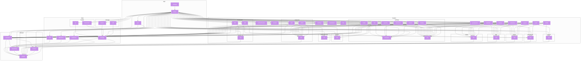

# :app:jvmApp

## Module dependency graph

```mermaid
%%{
  init: {
    'theme': 'neutral'
  }
}%%

graph TB
  subgraph :feature
    :feature:authentication["authentication"]
    :feature:readlater["readlater"]
    :feature:settings["settings"]
    :feature:history["history"]
    :feature:collection["collection"]
    :feature:folder["folder"]
    :feature:bookshelf["bookshelf"]
    :feature:file["file"]
    :feature:permission["permission"]
    :feature:authentication["authentication"]
    :feature:book["book"]
    :feature:bookshelf["bookshelf"]
    :feature:collection["collection"]
    :feature:file["file"]
    :feature:folder["folder"]
    :feature:history["history"]
    :feature:permission["permission"]
    :feature:readlater["readlater"]
    :feature:search["search"]
    :feature:settings["settings"]
    :feature:tutorial["tutorial"]
    :feature:search["search"]
    :feature:tutorial["tutorial"]
    :feature:book["book"]
    subgraph :bookshelf
      :feature:bookshelf:nav["nav"]
      :feature:bookshelf:nav["nav"]
      :feature:bookshelf:info["info"]
      :feature:bookshelf:edit["edit"]
      :feature:bookshelf:info["info"]
      :feature:bookshelf:nav["nav"]
      :feature:bookshelf:edit["edit"]
    end
    subgraph :settings
      :feature:settings:folder["folder"]
      :feature:settings:common["common"]
      :feature:settings:nav["nav"]
      :feature:settings:info["info"]
      :feature:settings:extension["extension"]
      :feature:settings:security["security"]
      :feature:settings:viewer["viewer"]
      :feature:settings:common["common"]
      :feature:settings:display["display"]
      :feature:settings:extension["extension"]
      :feature:settings:folder["folder"]
      :feature:settings:info["info"]
      :feature:settings:nav["nav"]
      :feature:settings:security["security"]
      :feature:settings:viewer["viewer"]
      :feature:settings:display["display"]
    end
    subgraph :tutorial
      :feature:tutorial:nav["nav"]
      :feature:tutorial:nav["nav"]
    end
    subgraph :authentication
      :feature:authentication:nav["nav"]
      :feature:authentication:nav["nav"]
    end
    subgraph :collection
      :feature:collection:nav["nav"]
      :feature:collection:nav["nav"]
      :feature:collection:add["add"]
      :feature:collection:editor["editor"]
      :feature:collection:nav["nav"]
      :feature:collection:add["add"]
      :feature:collection:editor["editor"]
    end
    subgraph :book
      :feature:book:nav["nav"]
      :feature:book:nav["nav"]
      :feature:book:nav["nav"]
    end
    subgraph :file
      :feature:file:nav["nav"]
      :feature:file:nav["nav"]
      :feature:file:nav["nav"]
    end
    subgraph :folder
      :feature:folder:nav["nav"]
      :feature:folder:nav["nav"]
      :feature:folder:nav["nav"]
    end
    subgraph :permission
      :feature:permission:nav["nav"]
      :feature:permission:nav["nav"]
      :feature:permission:nav["nav"]
    end
    subgraph :search
      :feature:search:nav["nav"]
      :feature:search:nav["nav"]
      :feature:search:nav["nav"]
    end
  end
  subgraph :domain
    :domain:model["model"]
    :domain:usecase["usecase"]
    :domain:usecase["usecase"]
    :domain:model["model"]
    :domain:repository["repository"]
    :domain:service["service"]
    :domain:repository["repository"]
    :domain:repository["repository"]
    :domain:service["service"]
    :domain:usecase["usecase"]
    :domain:service["service"]
  end
  subgraph :data
    :data:coil["coil"]
    :data:storage["storage"]
    :data:datastore["datastore"]
    :data:database["database"]
    :data:coil["coil"]
    :data:database["database"]
    :data:datastore["datastore"]
    :data:storage["storage"]
    :data:storage["storage"]
    subgraph :reader
      :data:reader:zip["zip"]
      :data:reader:document["document"]
      :data:reader:document["document"]
      :data:reader:zip["zip"]
    end
    subgraph :storage
      :data:storage:device["device"]
      :data:storage:device["device"]
      :data:storage:smb["smb"]
      :data:storage:smb["smb"]
    end
  end
  subgraph :app
    :app:jvmApp["jvmApp"]
    :app:share["share"]
    :app:share["share"]
    :app:sync["sync"]
    :app:sync["sync"]
  end

  :feature:bookshelf:nav --> :domain:model
  :feature:settings:folder --> :domain:usecase
  :feature:settings:folder --> :feature:settings:common
  :feature:settings:folder --> :feature:settings:nav
  :feature:settings:info --> :domain:usecase
  :feature:settings:info --> :feature:settings:common
  :feature:settings:info --> :feature:settings:nav
  :feature:settings:info --> :feature:tutorial:nav
  :domain:usecase --> :domain:model
  :domain:usecase --> :domain:repository
  :domain:usecase --> :domain:service
  :data:coil --> :domain:repository
  :feature:authentication --> :domain:usecase
  :feature:authentication --> :feature:authentication:nav
  :feature:collection:nav --> :domain:model
  :domain:repository --> :domain:model
  :feature:readlater --> :domain:usecase
  :feature:readlater --> :feature:book:nav
  :feature:readlater --> :feature:collection:nav
  :feature:readlater --> :feature:file:nav
  :feature:readlater --> :feature:folder:nav
  :feature:readlater --> :feature:settings:nav
  :feature:settings:extension --> :domain:usecase
  :feature:settings:extension --> :feature:settings:common
  :feature:settings:extension --> :feature:settings:nav
  :data:reader:zip --> :data:storage
  :feature:settings:security --> :domain:usecase
  :feature:settings:security --> :feature:settings:common
  :feature:settings:security --> :feature:settings:nav
  :feature:settings:security --> :feature:authentication:nav
  :feature:settings --> :domain:usecase
  :feature:settings --> :feature:settings:common
  :feature:settings --> :feature:settings:nav
  :data:datastore --> :domain:repository
  :data:storage:device --> :data:storage
  :feature:history --> :domain:usecase
  :feature:history --> :feature:book:nav
  :feature:history --> :feature:collection:nav
  :feature:history --> :feature:file:nav
  :feature:history --> :feature:folder:nav
  :feature:history --> :feature:settings:nav
  :feature:folder:nav --> :domain:model
  :feature:file:nav --> :domain:model
  :feature:collection --> :domain:usecase
  :feature:collection --> :feature:book:nav
  :feature:collection --> :feature:collection:nav
  :feature:collection --> :feature:file:nav
  :feature:collection --> :feature:folder:nav
  :feature:collection --> :feature:settings:nav
  :feature:folder --> :domain:usecase
  :feature:folder --> :feature:book:nav
  :feature:folder --> :feature:collection:nav
  :feature:folder --> :feature:folder:nav
  :feature:folder --> :feature:permission:nav
  :feature:folder --> :feature:search:nav
  :feature:folder --> :feature:settings:nav
  :feature:folder --> :feature:file:nav
  :data:database --> :domain:repository
  :data:database --> :domain:service
  :app:jvmApp --> :app:share
  :data:reader:document --> :data:storage
  :feature:bookshelf --> :domain:usecase
  :feature:bookshelf --> :feature:bookshelf:nav
  :feature:bookshelf --> :feature:folder:nav
  :feature:bookshelf --> :feature:settings:nav
  :feature:file --> :domain:usecase
  :feature:file --> :feature:file:nav
  :feature:file --> :feature:collection:nav
  :feature:file --> :feature:folder:nav
  :feature:permission --> :domain:usecase
  :feature:permission --> :feature:permission:nav
  :feature:bookshelf:info --> :domain:usecase
  :feature:bookshelf:info --> :feature:bookshelf:nav
  :feature:bookshelf:info --> :feature:permission:nav
  :feature:settings:viewer --> :domain:usecase
  :feature:settings:viewer --> :feature:settings:common
  :feature:settings:viewer --> :feature:settings:nav
  :feature:book:nav --> :domain:model
  :app:share --> :data:coil
  :app:share --> :data:database
  :app:share --> :data:datastore
  :app:share --> :data:storage
  :app:share --> :domain:model
  :app:share --> :domain:repository
  :app:share --> :domain:service
  :app:share --> :domain:usecase
  :app:share --> :feature:authentication
  :app:share --> :feature:book
  :app:share --> :feature:bookshelf
  :app:share --> :feature:collection
  :app:share --> :feature:file
  :app:share --> :feature:folder
  :app:share --> :feature:history
  :app:share --> :feature:permission
  :app:share --> :feature:readlater
  :app:share --> :feature:search
  :app:share --> :feature:settings
  :app:share --> :feature:tutorial
  :app:share --> :data:reader:document
  :app:share --> :data:reader:zip
  :app:share --> :data:storage:device
  :app:share --> :data:storage:smb
  :app:share --> :feature:authentication:nav
  :app:share --> :feature:book:nav
  :app:share --> :feature:bookshelf:edit
  :app:share --> :feature:bookshelf:info
  :app:share --> :feature:bookshelf:nav
  :app:share --> :feature:collection:add
  :app:share --> :feature:collection:editor
  :app:share --> :feature:collection:nav
  :app:share --> :feature:file:nav
  :app:share --> :feature:folder:nav
  :app:share --> :feature:permission:nav
  :app:share --> :feature:search:nav
  :app:share --> :feature:settings:common
  :app:share --> :feature:settings:display
  :app:share --> :feature:settings:extension
  :app:share --> :feature:settings:folder
  :app:share --> :feature:settings:info
  :app:share --> :feature:settings:nav
  :app:share --> :feature:settings:security
  :app:share --> :feature:settings:viewer
  :app:share --> :feature:tutorial:nav
  :app:share --> :app:sync
  :feature:permission:nav --> :domain:model
  :data:storage:smb --> :data:storage
  :feature:search --> :domain:usecase
  :feature:search --> :feature:book:nav
  :feature:search --> :feature:collection:nav
  :feature:search --> :feature:file:nav
  :feature:search --> :feature:folder:nav
  :feature:search --> :feature:search:nav
  :feature:search --> :feature:settings:nav
  :feature:tutorial --> :domain:usecase
  :feature:tutorial --> :feature:tutorial:nav
  :feature:book --> :domain:usecase
  :feature:book --> :feature:book:nav
  :feature:book --> :feature:permission:nav
  :feature:book --> :feature:settings:nav
  :feature:collection:add --> :domain:usecase
  :feature:collection:add --> :feature:collection:nav
  :feature:settings:display --> :domain:usecase
  :feature:settings:display --> :feature:settings:common
  :feature:settings:display --> :feature:settings:nav
  :data:storage --> :domain:repository
  :data:storage --> :domain:service
  :domain:service --> :domain:model
  :app:sync --> :domain:repository
  :app:sync --> :domain:usecase
  :feature:collection:editor --> :domain:usecase
  :feature:collection:editor --> :feature:collection:nav
  :feature:search:nav --> :domain:model
  :feature:bookshelf:edit --> :domain:usecase
  :feature:bookshelf:edit --> :feature:bookshelf:nav
  :feature:bookshelf:edit --> :feature:permission:nav

classDef kotlin-multiplatform fill:#C792EA,stroke:#fff,stroke-width:2px,color:#fff;
class :feature:bookshelf:nav kotlin-multiplatform
class :domain:model kotlin-multiplatform
class :feature:settings:folder kotlin-multiplatform
class :domain:usecase kotlin-multiplatform
class :feature:settings:common kotlin-multiplatform
class :feature:settings:nav kotlin-multiplatform
class :feature:settings:info kotlin-multiplatform
class :feature:tutorial:nav kotlin-multiplatform
class :domain:repository kotlin-multiplatform
class :domain:service kotlin-multiplatform
class :data:coil kotlin-multiplatform
class :feature:authentication kotlin-multiplatform
class :feature:authentication:nav kotlin-multiplatform
class :feature:collection:nav kotlin-multiplatform
class :feature:readlater kotlin-multiplatform
class :feature:book:nav kotlin-multiplatform
class :feature:file:nav kotlin-multiplatform
class :feature:folder:nav kotlin-multiplatform
class :feature:settings:extension kotlin-multiplatform
class :data:reader:zip kotlin-multiplatform
class :data:storage kotlin-multiplatform
class :feature:settings:security kotlin-multiplatform
class :feature:settings kotlin-multiplatform
class :data:datastore kotlin-multiplatform
class :data:storage:device kotlin-multiplatform
class :feature:history kotlin-multiplatform
class :feature:collection kotlin-multiplatform
class :feature:folder kotlin-multiplatform
class :feature:permission:nav kotlin-multiplatform
class :feature:search:nav kotlin-multiplatform
class :data:database kotlin-multiplatform
class :app:jvmApp kotlin-multiplatform
class :app:share kotlin-multiplatform
class :data:reader:document kotlin-multiplatform
class :feature:bookshelf kotlin-multiplatform
class :feature:file kotlin-multiplatform
class :feature:permission kotlin-multiplatform
class :feature:bookshelf:info kotlin-multiplatform
class :feature:settings:viewer kotlin-multiplatform
class :feature:book kotlin-multiplatform
class :feature:search kotlin-multiplatform
class :feature:tutorial kotlin-multiplatform
class :data:storage:smb kotlin-multiplatform
class :feature:bookshelf:edit kotlin-multiplatform
class :feature:collection:add kotlin-multiplatform
class :feature:collection:editor kotlin-multiplatform
class :feature:settings:display kotlin-multiplatform
class :app:sync kotlin-multiplatform

```