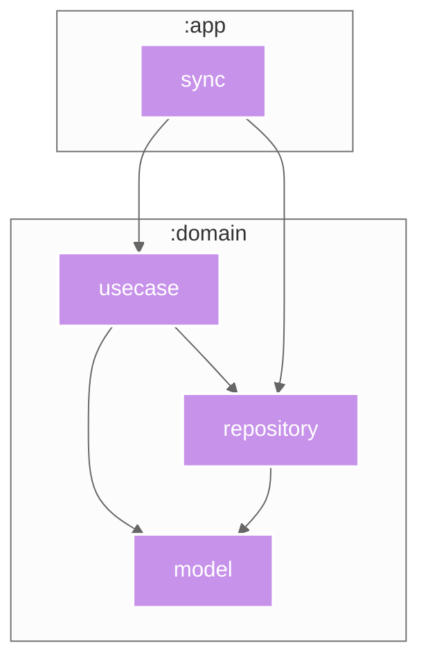

# :app:sync

## Module dependency graph

```mermaid
%%{
  init: {
    'theme': 'neutral'
  }
}%%

graph TB
  subgraph :domain
    :domain:usecase["usecase"]
    :domain:model["model"]
    :domain:repository["repository"]
  end
  subgraph :app
    :app:sync["sync"]
  end

  :domain:usecase --> :domain:model
  :domain:usecase --> :domain:repository
  :domain:repository --> :domain:model
  :app:sync --> :domain:repository
  :app:sync --> :domain:usecase

classDef kotlin-multiplatform fill:#C792EA,stroke:#fff,stroke-width:2px,color:#fff;
class :domain:usecase kotlin-multiplatform
class :domain:model kotlin-multiplatform
class :domain:repository kotlin-multiplatform
class :app:sync kotlin-multiplatform

```