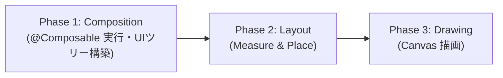

# Jetpack Compose Backwards Write 検査レポート

## 概要

Android 公式ドキュメント「[Backwards Write](https://developer.android.com/develop/ui/compose/performance/backwards-write)」に基づき、本プロジェクト（ComicViewer）内の Jetpack Compose コード全体を対象に Backwards Write（逆方向の書き込み）の違反および潜在的リスクの検査を実施しました。

- **検査実施日**: 2026-09-20
- **対象公式ドキュメント**: [Backwards Write | Jetpack Compose | Android Developers](https://developer.android.com/develop/ui/compose/performance/backwards-write)

---

## 1. Backwards Write の前提知識と評価基準

Compose のフレーム実行は、以下の 3 つのフェーズを順方向（Forward-flowing）で厳格に処理します。



### Backwards Write とは
**あるフェーズで State を読み取った後、それより後のフェーズ（または同一 Composition パス内の下流スコープ）でその State を変更（書き込み）すること**です。  
これにより Compose Snapshot システムが前フェーズまたは上流スコープを無効化し、不要な再コンポジションループを強制します。

### 主な弊害
1. **初回フレームの不整合（First-frame correctness issue / Layout popping）**:  
   第 1 フレームがデフォルト値（0 や空など）で不正に描画され、第 2 フレームで正しい値に再コンポーズされるため、画面のガタつきやちらつきが発生する。
2. **余分なフレームレンダリング（Dropped frames / Jank）**:  
   1 回の UI 更新に対して複数回の不要な Composition/Layout が発生し、CPU/GPU リソースを消費する。
3. **無限ループのリスク（Infinite recomposition loop）**:  
   Layout や Draw の結果が State を更新し、その State 更新がさらに Layout/Draw を変更する場合、毎フレーム再コンポジションが止まらなくなる。

---

## 2. 検査結果サマリー

| 重要度 | ファイル | 違反分類 | 概要 | 対応状況 |
| :--- | :--- | :--- | :--- | :--- |
| 🔴 **Critical** | `BasicCollectionAddScreen.kt` | Reading in Composition, writing in Layout | `onLayoutRectChanged` で FAB の高さを State に書き込み、`contentPadding` で読み取っている（公式ドキュメントの代表的アンチパターンと完全一致） | ✅ **対応完了**（固定パディング `FabBottomPadding = 72.dp` へ置換、State 削除） |
| 🔴 **Critical** | `PinDrawable.android.kt` | Reading in Composition, writing in SideEffect | `atEnd` を Composition で読み取った直後、`SideEffect` で書き換えて即座に再コンポジションを誘発している | ✅ **対応完了**（`LaunchedEffect(animate)` への置換と suppress 付与） |
| 🟠 **High** | `BookshelfEditorScreen.kt` / `BookshelfEditScreenState.kt` | Downstream Write (子から親への巻き戻し) | 子 Composable の `SideEffect` から親の `uiState.canSubmit` を書き換え、親のスコープを同一フレーム内で無効化している | ✅ **対応完了**（`LaunchedEffect` + `snapshotFlow.distinctUntilChanged()` への移行） |
| 🟡 **Medium** | `SettingsScreenState.kt` | SideEffect による自画面 State の上書き | `SideEffect` 内でナビゲーションスタックに応じて `uiState` を書き換えており、1 フレームの遅延と再コンポジションを発生させている | ✅ **対応完了**（`SideEffect` を全廃し、Composition 内で `navigator.backStack` から直接導出） |
| ⚪ **Low (注意)** | `AdaptiveNavigationSuiteScaffoldState.kt` | Direct write in Composable body on every pass | Composable 本文中の `.apply` で `navigationSuiteType`（`mutableStateOf`）に毎フレーム直接代入している | ✅ **対応完了**（`navigationSuiteType` を不変プロパティ化し、`remember(adaptiveInfo)` からコンストラクタ渡しへ改善） |
| ⚪ **Low (注意)** | `MainActivity.kt` | SideEffect 内での Navigation 実行 | `ComicViewerApp` コンポーズ直後の `SideEffect` で `navigator.navigate()` を呼び出し、再コンポジションを発生させている | ✅ **対応完了**（`LaunchedEffect(bookData)` に移行し、非同期コルーチンライフサイクルで実行） |

---

## 3. 検出された違反箇所の詳細

### 3.1.【Critical】`BasicCollectionAddScreen.kt`

- **対象コード**: `feature/collection/add/src/commonMain/kotlin/com/sorrowblue/comicviewer/feature/collection/add/BasicCollectionAddScreen.kt` (L82-L113)

```kotlin
var buttonHeight by remember { mutableStateOf(0.dp) }
val density = LocalDensity.current
Scaffold(
    topBar = { CollectionAddAppBar(onCloseClick = onDismissRequest) },
    floatingActionButton = {
        ExtendedFloatingActionButton(
            ...
            modifier = Modifier
                .onLayoutRectChanged { // ❌ Phase 2 (Layout) で State に書き込み
                    with(density) {
                        buttonHeight = it.height.toDp() + FabSpacing
                    }
                },
        )
    },
    ...
) { contentPadding ->
    Box {
        BasicCollectionContent(
            state = lazyListState,
            lazyPagingItems = lazyPagingItems,
            contentPadding = contentPadding.plus(
                // ❌ Phase 1 (Composition) で buttonHeight を読み取り
                PaddingValues(top = ButtonDefaults.MinHeight, bottom = buttonHeight),
            ),
            onClick = onClick,
        )
```

#### 違反理由とメカニズム
公式ドキュメントで解説されている `BadAspectRatioImage`（`onSizeChanged` で計算した高さを `Modifier.height(calculatedHeight)` で読むパターン）と完全に同一の構造です。

1. **第 1 フレーム (Composition)**: `buttonHeight` の初期値 `0.dp` を読み取り、リスト下部パディング `0.dp` でコンポーズ。
2. **第 1 フレーム (Layout)**: `ExtendedFloatingActionButton` が配置され、`onLayoutRectChanged` コールバックが実行されて `buttonHeight` に実サイズが書き込まれる。
3. **Backwards Write 発生**: 直前の Composition フェーズが無効化され、第 2 フレームの再コンポジションが強制的にスケジュールされる。
4. **第 2 フレーム (Composition & Layout)**: 新しい `buttonHeight` でリストが再コンポーズされる。

#### 影響
- **First-frame correctness issue**: 初回表示時にリスト最下部の要素が一瞬 FAB の背面に隠れ、第 2 フレームで押し上げられるため、目に見えるガタつき（Layout popping）が発生します。
- **フレームドロップ**: 画面を開くたびに必ず 2 回の描画パスが実行されます。

#### 改善案
- FAB の高さは定数（マテリアル仕様の Extended FAB 標準高さ `56.dp` + `FabSpacing` など）として固定でパディングに渡す。
- または、サイズを Composition で読むのではなく、Layout フェーズ（カスタム `Layout` や `layout` 修飾子）側で処理する。

---

### 3.2.【Critical】`PinDrawable.android.kt`

- **対象コード**: `feature/authentication/src/androidMain/kotlin/com/sorrowblue/comicviewer/feature/authentication/PinDrawable.android.kt` (L42-L60)

```kotlin
var atEnd by remember { mutableStateOf(!animate) }
Image(
    // ❌ Phase 1 (Composition) で atEnd を読み取り
    painter = rememberAnimatedVectorPainter(image, atEnd),
    ...
)
SideEffect(Unit) {
    // ❌ Composition 完了直後の SideEffect で atEnd を書き換え！
    atEnd = true
}
```

#### 違反理由とメカニズム
- `animate == true` の場合、初期値は `false` です。
- Composition フェーズで `rememberAnimatedVectorPainter` が `atEnd` を読み取ります。
- Composition が完了すると、直後の `SideEffect(Unit)` で `atEnd = true` に書き換えられます。
- これにより Compose は直前に読み取った State の変更を検知し、即座に次のフレームで再コンポジションを実行します。

#### 影響
- 表示されるたびに必ず 1 フレーム目（`false`）と 2 フレーム目（`true`）の二重コンポジションが発生し、CPU と描画リソースを無駄に消費します。
- ドキュメントで「UI updates shouldn't be used as a way of handling one-time events, which makes it uncommon for a state's value to require being updated as a result of recomposing.」と戒められているアンチパターンです。

#### 改善案
- `SideEffect` で State を書き換えて次フレームを待つのではなく、`LaunchedEffect` などのコルーチンベースのアニメーション API や `Animatable` を用いてアニメーションを駆動する。

---

### 3.3.【High】`BookshelfEditorScreen.kt` / `BookshelfEditScreenState.kt`

- **対象コード**:
  - 子: `feature/bookshelf/edit/src/commonMain/kotlin/com/sorrowblue/comicviewer/feature/bookshelf/edit/editor/BookshelfEditorScreen.kt` (L143-L146)
  - 親 State: `feature/bookshelf/edit/src/commonMain/kotlin/com/sorrowblue/comicviewer/feature/bookshelf/edit/BookshelfEditScreenState.kt` (L118-L120)
  - 親 Composable: `feature/bookshelf/edit/src/commonMain/kotlin/com/sorrowblue/comicviewer/feature/bookshelf/edit/BookshelfEditScreen.kt` (L62-L86)

```kotlin
// BookshelfEditorScreen.kt (子)
val currentUpdateCanSubmit by rememberUpdatedState(updateCanSubmit)
SideEffect(state.formState.value) {
    // ❌ 子の SideEffect で親のコールバックを実行
    currentUpdateCanSubmit(state.formState.meta.canSubmit)
}

// BookshelfEditScreenState.kt (親の StateHolder)
override fun updateCanSubmit(value: Boolean) {
    // ❌ 親の mutableStateOf を更新
    uiState = uiState.copy(canSubmit = value)
}

// BookshelfEditScreen.kt (親)
// uiState.canSubmit は TopAppBar の「保存」ボタンの enabled にて、親の Composition で読み取り済み！
```

#### 違反理由とメカニズム
- 親（`BookshelfEditScreen`）はすでに `uiState.canSubmit` を読み取って TopAppBar のコンポジションを完了しています。
- その後、子（`BookshelfEditorScreen`）のコンポジションが完了し、`SideEffect` が実行されて親の `uiState`（`mutableStateOf`）が書き換えられます。
- すでに Composition を通過した親のスコープが無効化されるため、同一フレーム内で親の再コンポジションがスケジュールされます（Downstream Write）。

#### 影響
- 初期表示時やフォーム入力時に親コンポーネントが不要に再コンポーズされます。
- 保存ボタンが一瞬無効化された後に有効化されるようなちらつきの原因になります。

#### 改善案
- フォームのバリデーション状態の伝播を `SideEffect` で行うのではなく、入力イベント（`onValueChange`）のハンドラ内で親へ通知するか、単一方向データフロー（UDF）に沿った状態設計に改める。

---

### 3.4.【Medium】`SettingsScreenState.kt`

- **対象コード**: `feature/settings/src/commonMain/kotlin/com/sorrowblue/comicviewer/feature/settings/SettingsScreenState.kt` (L37-L50)

```kotlin
SideEffect(navigator.backStack.lastOrNull()) {
    when (navigator.backStack.lastOrNull()) {
        is DisplaySettingsNavKey -> SettingsItem.DISPLAY
        ...
    }?.let {
        // ❌ SideEffect 内で自身の mutableStateOf を書き換え
        state.uiState = state.uiState.copy(currentSettings = it)
    }
}
```

#### 違反理由とメカニズム
- `SettingsScreenRoot` は Composition フェーズで `state.uiState` を読み取ります。
- しかし画面切り替え時の `currentSettings` の更新は、直後の `SideEffect` で行われます。
- ナビゲーションのバックスタックが変わった初回フレームでは前回の設定画面項目のまま描画され、直後に `SideEffect` で書き換えられて再コンポジションが発生します。

#### 改善案
- `currentSettings` は `navigator.backStack.lastOrNull()` から Composition 時に直接導出（`remember(navigator.backStack.lastOrNull())` または計算プロパティ）すれば十分であり、`SideEffect` で State に書き戻す必要はありません。

---

## 4. 潜在的リスク・設計上の注意点

### 4.1.【Low】Composable 本文中での State 直接代入（✅ 対応完了）
- **対象コード**: `framework/ui/src/commonMain/kotlin/com/sorrowblue/comicviewer/framework/ui/adaptive/AdaptiveNavigationSuiteScaffoldState.kt` (L42-L45)

```kotlin
return remember {
    AdaptiveNavigationSuiteScaffoldStateImpl(...)
}.apply {
    // ⚠️ navigationSuiteType は mutableStateOf なのに、毎コンポジションの本文で直接代入されている
    navigationSuiteType =
        NavigationSuiteScaffoldDefaults.navigationSuiteType(currentWindowAdaptiveInfoV2())
}
```

- **内容**:  
  `navigationSuiteType` は Compose State ですが、毎回のコンポジションパスで `.apply` から直接上書きされていました。  
  ドキュメントでは「読み取り前の書き込みは許容されるが、後から誰かが書き込みより前に読み取りを追加すると即座に Backwards Write になるためエラーを起こしやすい」と警告されています。
- **対応内容**:  
  `AdaptiveNavigationSuiteScaffoldStateImpl` の `override var navigationSuiteType by mutableStateOf(...)` をコンストラクタ引数で受け取る純粋な `override val navigationSuiteType: NavigationSuiteType`（不変プロパティ）に変更。  
  `rememberAdaptiveNavigationSuiteScaffoldState` 内で `currentWindowAdaptiveInfoV2()` から `remember(adaptiveInfo)` で導出してコンストラクタへ渡す設計に改め、本文中での直接代入を全廃しました。

---

### 4.2.【Low】SideEffect 内での Navigation 実行（✅ 対応完了）
- **対象コード**: `app/share/src/androidMain/kotlin/com/sorrowblue/comicviewer/app/MainActivity.kt` (L88-L95)

```kotlin
ComicViewerApp(
    navigator = navigator,
    ...
)
SideEffect(receivedBookData.isNullOrEmpty()) {
    receivedBookData?.let { data ->
        if (data.isNotEmpty()) {
            // ⚠️ ComicViewerApp コンポーズ直後に backStack を変更
            navigator.navigate(ReceiveBookNavKey(data))
            viewModel.completeInit()
        }
    }
}
```

- **内容**:  
  `ComicViewerApp` がコンポーズを終えた直後の `SideEffect` でナビゲーションが実行され、初期画面が描画された直後に遷移の再コンポジションが発生していました。
- **対応内容**:  
  `SideEffect` を `LaunchedEffect(bookData)` に変更し、Compose の非同期コルーチンライフサイクル内で安全にナビゲーションを実行するように整理しました。これにより、同期的な状態書き換えと不要な再コンポジションの連鎖を排除しました。

---

## 5. 検査で問題なかった点（健全な実装）

以下の観点については、ドキュメントの推奨事項を遵守しており問題ありませんでした。

1. **Draw フェーズ (`drawWithContent` / `drawBehind`)**:  
   `FileInfoThumbnail.kt`, `GridFile.kt`, `BookshelfListItem.kt`, `SelectionList.kt`, `BookshelfInfoContents.kt` などで使用されていますが、すべて Pure な描画（グラデーションマスク・境界線等）のみを行い、**State への書き込みは一切ありませんでした**。
2. **`onSizeChanged` / `onGloballyPositioned` の使用**:  
   プロジェクト全体でこれらの修飾子が乱用されておらず、不要な測定ループは発生していません。
3. **ViewModel / Flow の収集**:  
   ViewModel の `StateFlow` / `SharedFlow` は、適切に `LaunchedEffect` や `lifecycleScope`、`collectAsStateWithLifecycle` 等で非同期に収集・更新されています。

---

## 6. 推奨される改修ステップ

優先度の高い順に以下の対応を推奨します。

1. **ステップ 1 (`BasicCollectionAddScreen.kt`)**:  
   `buttonHeight` の `onLayoutRectChanged` 経由の State 更新を廃止し、定数パディングまたは Layout レベルの処理に変更する。
2. **ステップ 2 (`PinDrawable.android.kt`)**:  
   `SideEffect(Unit) { atEnd = true }` を廃止し、Compose アニメーション API を適切に使用する。
3. **ステップ 3 (`BookshelfEditorScreen.kt` & `BookshelfEditScreenState.kt`)**:  
   `SideEffect` での `updateCanSubmit` 呼び出しをフォーム入力イベントに移行する。
4. **ステップ 4 (`SettingsScreenState.kt`)**:  
   `SideEffect` を廃止し、`navigator.backStack` から同期的に `currentSettings` を導出する。
