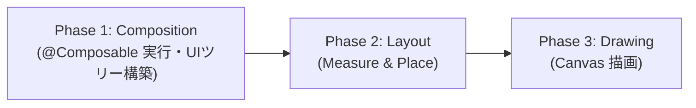

# Jetpack Compose Backwards Write 検査レポート

## 概要

Android 公式ドキュメント「[Backwards Write](https://developer.android.com/develop/ui/compose/performance/backwards-write)」に基づき、本プロジェクト（ComicViewer）内の Jetpack Compose コード全体を対象に Backwards Write（逆方向の書き込み）の違反および潜在的リスクの検査を実施しました。

- **初回検査日**: 2026-09-20
- **最新更新日**: 2026-09-22
- **対象公式ドキュメント**: [Backwards Write | Jetpack Compose | Android Developers](https://developer.android.com/develop/ui/compose/performance/backwards-write)

---

## 1. Backwards Write の前提知識と評価基準

Compose のフレーム実行は、以下の 3 つのフェーズを順方向（Forward-flowing）で厳格に処理します。



### Backwards Write とは
**あるフェーズで State を読み取った後、それより後のフェーズ（または同一 Composition パス内の下流スコープ / SideEffect）でその State を変更（書き込み）すること**です。  
これにより Compose Snapshot システムが前フェーズまたは上流スコープを無効化し、不要な再コンポジションループを強制します。

### 主な弊害
1. **初回フレームの不整合（First-frame correctness issue / Layout popping）**:  
   第 1 フレームがデフォルト値（0 や空など）で不正に描画され、第 2 フレームで正しい値に再コンポーズされるため、画面のガタつきやちらつきが発生する。
2. **余分なフレームレンダリング（Dropped frames / Jank）**:  
   1 回の UI 更新に対して複数回の不要な Composition/Layout が発生し、CPU/GPU リソースを消費する。
3. **無限ループのリスク（Infinite recomposition loop）**:  
   Layout や Draw の結果が State を更新し、その State 更新がさらに Layout/Draw を変更する場合、毎フレーム再コンポジションが止まらなくなる。

---

## 2. 検査結果サマリー

| 重要度 | ファイル / 箇所 | 違反分類 | 概要 | 対応状況 |
| :--- | :--- | :--- | :--- | :--- |
| 🔴 **Critical** | `BasicCollectionAddScreen.kt` | Reading in Composition, writing in Layout | `onLayoutRectChanged` で FAB の高さを State に書き込み、`contentPadding` で読み取っていた（公式ドキュメントの代表的アンチパターン） | ✅ **対応完了**（固定パディング `FabBottomPadding = 72.dp` へ置換、State 削除） |
| 🟠 **High** | `LocalNetworkAccessPermissionScreenRoot.kt` | Downstream Write (子から親への巻き戻し) | `SideEffect` 内で `onDismissRequest`（実体は `navigator.goBack()`）を呼び出し、親の `backStack` を同期変更していた | ✅ **対応完了**（`LaunchedEffect` + `snapshotFlow.first()` への移行） |
| 🟠 **High** | `BookshelfEditorScreen.kt` / `BookshelfEditScreenState.kt` | Downstream Write (子から親への巻き戻し) | 子 Composable の `SideEffect` から親の `uiState.canSubmit` を書き換え、親のスコープを同一フレーム内で無効化していた | ✅ **対応完了**（`LaunchedEffect` + `snapshotFlow.distinctUntilChanged()` への移行） |
| 🟡 **Medium** | `SecuritySettingsScreenState.android.kt` | Direct write in Composable body | Composable 関数本文内で `resultLauncherState.value`（`mutableStateOf`）に毎フレーム直接代入していた | ✅ **対応完了**（`mutableStateOf` を廃止し `lateinit var` へ移行） |
| 🟡 **Medium** | `SettingsScreenState.kt` | SideEffect による自画面 State の上書き | `SideEffect` 内でナビゲーションスタックに応じて `uiState` を書き換えており、1 フレームの遅延と再コンポジションを発生させていた | ✅ **対応完了**（`SideEffect` を全廃し、Composition 内で `navigator.backStack` から直接導出） |
| 🟡 **Medium** | `PinDrawable.android.kt` | Multi-frame state popping | `atEnd` を Composition で読み取った直後、`LaunchedEffect` で書き換えて常に 2 フレームの描画を強制している | ℹ️ **現状維持**（AVD アニメーション開始のための既知パターン） |
| ⚪ **Low (注意)** | `FileLazyVerticalGrid.kt` | 不適切な State 保持・キー欠落 | `remember` 内で一度も更新されない `mutableStateOf` を生成しており、さらに外部参照する値がキーに含まれていなかった | ✅ **対応完了**（キー補正、直接計算化、不要な `mutableStateOf` 削除） |
| ⚪ **Low (注意)** | `ExtraPaneScaffold.kt` | 不要な State 生成 | 単純な真偽値判定（`== 1`）を `remember` 内で `mutableStateOf` に保持していた | ✅ **対応完了**（通常のローカル変数へ簡略化、State 削除） |
| ⚪ **Low (注意)** | `BookshelfInfoActionButtons.kt` | 不要な State 生成 | 単純な真偽値判定（`== 1`）を `remember` 内で `mutableStateOf` に保持していた | ✅ **対応完了**（通常のローカル変数へ簡略化、State 削除） |
| ⚪ **Low (注意)** | `AuthenticationScreen.kt` | 不要な State 生成 | 画面向き・サイズの真偽値判定を `remember` 内で `mutableStateOf` に保持していた | ✅ **対応完了**（通常のローカル変数へ簡略化、State 削除） |
| ⚪ **Low (注意)** | `PinTextField.kt` | 不要な State 生成 | `pin.count()` を `remember` 内で `mutableIntStateOf` に保持していた | ✅ **対応完了**（直接計算へ簡略化、State 削除） |
| ⚪ **Low (注意)** | `BookPager.kt` | 不要な State 生成 | `ImageRequest` を `remember` 内で `mutableStateOf` に保持していた | ✅ **対応完了**（通常の `remember` 計算値へ整理、State 削除） |
| ⚪ **Low (注意)** | `AdaptiveNavigationSuiteScaffoldState.kt` | Direct write in Composable body on every pass | Composable 本文中の `.apply` で `navigationSuiteType`（`mutableStateOf`）に毎フレーム直接代入していた | ✅ **対応完了**（`navigationSuiteType` を不変プロパティ化し、`remember(adaptiveInfo)` からコンストラクタ渡しへ改善） |
| ⚪ **Low (注意)** | `MainActivity.kt` | SideEffect 内での Navigation 実行 | `ComicViewerApp` コンポーズ直後の `SideEffect` で `navigator.navigate()` を呼び出し、再コンポジションを発生させていた | ✅ **対応完了**（`LaunchedEffect(bookData)` に移行し、非同期コルーチンライフサイクルで実行） |

---

## 3. 検出された違反箇所の詳細と対策

### 3.1.【Medium】`PinDrawable.android.kt`：State トグルによるアニメーション駆動
- **対象コード**: `feature/authentication/src/androidMain/kotlin/com/sorrowblue/comicviewer/feature/authentication/PinDrawable.android.kt` (L43-L63)

```kotlin
var atEnd by remember { mutableStateOf(!animate) }
Image(
    painter = rememberAnimatedVectorPainter(image, atEnd), // Phase 1 で atEnd=false を読み取り
    ...
)
LaunchedEffect(animate) {
    if (animate) {
        atEnd = true // 次フレームで atEnd=true に書き換え -> 再コンポーズ
    }
}
```

#### 違反理由とメカニズム
- `animate == true` で表示された際、第 1 フレームは `atEnd = false`（アニメーション開始前）で描画され、直後に `LaunchedEffect` が走って `atEnd = true` に更新され、第 2 フレームで再コンポーズされてアニメーションが再生されます。
- 同期的な Backwards Write ではないものの、「単一イベントのトリガーのために State の値を切り替えて再コンポジションを起こす」という Compose のアンチパターンに該当し、表示のたびに必ず 2 回の描画パスが発生します。
- そのため Detekt の `UnnecessaryLaunchedEffect` が検出され、`@Suppress` で抑制されています。

#### 改善案
- AVD（Animated Vector Drawable）の進行度を `rememberAnimatedVectorPainter` の boolean フラグで反転させるのではなく、Compose の `Animatable` を用いてアニメーションを駆動する。
- または、局所的な入力コンポーネントであり実害が軽微なため、現状維持とする。

---

## 4. 是正完了した違反箇所の記録

### 4.1.【Critical】`BasicCollectionAddScreen.kt`（2026-09-20 解消）
- **以前のコード**: `onLayoutRectChanged`（Layout フェーズ）で FAB 高さを `mutableStateOf` に書き込み、Composition フェーズの `contentPadding` で読み取っていた。
- **対応内容**: マテリアル仕様に基づく固定パディング `FabBottomPadding = 72.dp` へ置換し、`buttonHeight` State および `onLayoutRectChanged` を完全削除。

### 4.2.【High】`LocalNetworkAccessPermissionScreenRoot.kt`（2026-09-22 解消）
- **以前のコード**: `SideEffect(state)` 内で `currentOnDismissRequest()`（実体は `navigator.goBack()`）を呼び出していた。
- **対応内容**: `LaunchedEffect(requester)` + `snapshotFlow.filterIsInstance<Granted>().first()` へ移行し、非同期コルーチンコンテキストで安全に閉じるように改善。

### 4.3.【High】`BookshelfEditorScreen.kt`（2026-09-20 解消）
- **以前のコード**: 子 Composable の `SideEffect` から親の `uiState.canSubmit` を書き換えていた（Downstream Write）。
- **対応内容**: `LaunchedEffect(state.formState)` + `snapshotFlow.distinctUntilChanged()` による非同期通知へ移行。

### 4.4.【Medium】`SettingsScreenState.kt`（2026-09-20 解消）
- **以前のコード**: `SideEffect` 内でナビゲーションバックスタックを監視し、自画面の `uiState.currentSettings` を書き戻していた。
- **対応内容**: `rememberSettingsScreenState` の Composition 内で `navigator.backStack` から同期的に `currentSettings` を導出する設計に改善。

### 4.5.【Medium】`SecuritySettingsScreenState.android.kt`（2026-09-22 解消）
- **以前のコード**: Composable 本文で `state.resultLauncherState.value`（`mutableStateOf`）に `rememberLauncherForActivityResult` を毎フレーム直接代入していた。
- **対応内容**: `resultLauncherState` の `mutableStateOf` を廃止し、`lateinit var resultLauncher: ManagedActivityResultLauncher<Intent, ActivityResult>` に変更。通常のプロパティ代入にすることで、不要な State 生成と Composition フェーズでの State 書き込みリスクを解消。

### 4.6.【Low】`AdaptiveNavigationSuiteScaffoldState.kt`（2026-09-20 解消）
- **以前のコード**: Composable 本文の `.apply` で `navigationSuiteType`（`mutableStateOf`）に直接代入していた。
- **対応内容**: 不変プロパティ（`val`）化し、コンストラクタ渡しに改善。

### 4.7.【Low】`MainActivity.kt`（2026-09-20 解消）
- **以前のコード**: `SideEffect` 内で `navigator.navigate(...)` を呼び出して同期的に backStack を変更していた。
- **対応内容**: `LaunchedEffect(bookData)` に移行し、安全に実行。

### 4.8.【Low】`FileLazyVerticalGrid.kt`（2026-09-22 解消）
- **以前のコード**: `rememberLazyPagingColumnType` が `mutableStateOf` を生成して `State<LazyPagingColumn>` を返しており、`windowSizeClass` と `navigationSuiteType` が `remember` のキーに含まれていなかった。また、同ファイル内の `contentScale` と `filterQuality` も `by remember { mutableStateOf(...) }` で不要な State を生成していた。
- **対応内容**: `rememberLazyPagingColumnType` の戻り値を直接 `LazyPagingColumn` に変更し、不要な `mutableStateOf` を削除。キーに `windowSizeClass` と `navigationSuiteType` を追加して画面回転等のリサイズ時に正確に再計算されるよう改善。併せて `contentScale` や `filterQuality` も通常の `remember` 計算値に整理。

### 4.9.【Low】`ExtraPaneScaffold.kt`（2026-09-22 解消）
- **以前のコード**: 単純な真偽値判定（`scaffoldDirective.maxHorizontalPartitions == 1`）を `remember(maxHorizontalPartitions) { mutableStateOf(...) }` で State として保持していた。
- **対応内容**: 不要な `remember` と `mutableStateOf` を全廃し、通常のローカル変数 `val singlePane = scaffoldDirective.maxHorizontalPartitions == 1` に簡略化。

### 4.10.【Low】`BookshelfInfoActionButtons.kt`（2026-09-22 解消）
- **以前のコード**: `scaffoldDirective.maxHorizontalPartitions == 1` を `remember` 内で `mutableStateOf` に保持していた。
- **対応内容**: 不要な `remember` と `mutableStateOf` を全廃し、通常のローカル変数 `val singlePane = scaffoldDirective.maxHorizontalPartitions == 1` に簡略化。

### 4.11.【Low】`AuthenticationScreen.kt`（2026-09-22 解消）
- **以前のコード**: 画面向き・サイズの真偽値判定を `remember` 内で `mutableStateOf` に保持していた。
- **対応内容**: 不要な `remember` と `mutableStateOf` を全廃し、通常のローカル変数 `val isCompactLandscape = isCompactWindowClass && isLandscape` に簡略化。

### 4.12.【Low】`PinTextField.kt`（2026-09-22 解消）
- **以前のコード**: `pin.count()` を `remember(pin) { mutableIntStateOf(pin.count()) }` で保持していた。
- **対応内容**: 不要な `remember` と `mutableIntStateOf` を削除し、直接計算のローカル変数 `val pinCount = pin.count()` へ簡略化。

### 4.13.【Low】`BookPager.kt`（2026-09-22 解消）
- **以前のコード**: `DefaultBookPage` 内で `ImageRequest` を `remember(bookPage.index, cutWhitespace) { mutableStateOf(...) }` で State として保持していた。
- **対応内容**: 不要な `mutableStateOf` を削除し、通常の `remember(bookPage.index, cutWhitespace) { ... }` 計算値へ整理。

---

## 5. 検査で問題なかった点（健全な実装）

1. **Draw フェーズ (`drawWithContent`)**:  
   `FileInfoThumbnail.kt`, `GridFile.kt`, `BookshelfListItem.kt`, `SelectionList.kt`, `BookshelfInfoContents.kt` 等で使用されていますが、すべて Pure な描画（グラデーションマスク・境界線描画等）のみを行い、**State への書き込みは一切ありません**。
2. **Layout フェーズ (`MeasurePolicy` / `Layout`)**:  
   `FixedDefaultShortNavigationBarOverride.kt` 等のカスタム MeasurePolicy は純粋な測定と配置のみを行い、State 書き込みはありません。
3. **ジェスチャー処理 (`pointerInput`)**:  
   `BookSheet.kt` 等のタップ・スクロール検出は、入力イベント駆動で処理されており、Composition / Layout との干渉はありません。
4. **ViewModel / Flow の収集**:  
   ViewModel の `StateFlow` / `SharedFlow` は、適切に `EventEffect` や `collectAsStateWithLifecycle` 等で非同期に収集・更新されています。

---

## 6. 今後の推奨改修ステップ

残る項目は以下のみです。

1. **ステップ 1 (`PinDrawable.android.kt`)**:  
   AVD（Animated Vector Drawable）の進行状態を `Animatable` で駆動するか、局所的な入力コンポーネントであり実害が軽微なため現状維持とするか検討。


