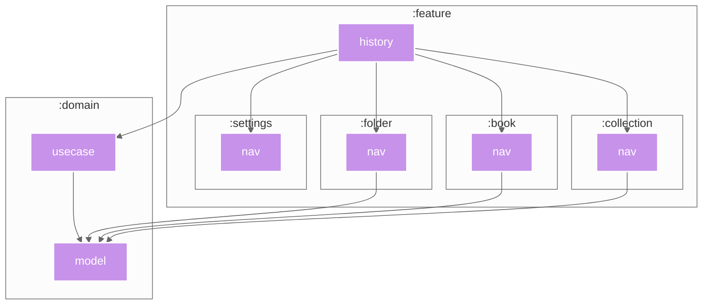

# :feature:history

## Module dependency graph

```mermaid
%%{
  init: {
    'theme': 'neutral'
  }
}%%

graph TB
  subgraph :feature
    :feature:history["history"]
    subgraph :book
      :feature:book:nav["nav"]
      :feature:book:nav["nav"]
    end
    subgraph :collection
      :feature:collection:nav["nav"]
      :feature:collection:nav["nav"]
    end
    subgraph :folder
      :feature:folder:nav["nav"]
      :feature:folder:nav["nav"]
    end
    subgraph :settings
      :feature:settings:nav["nav"]
    end
  end
  subgraph :domain
    :domain:usecase["usecase"]
    :domain:usecase["usecase"]
    :domain:model["model"]
    :domain:model["model"]
  end

  :feature:history --> :domain:usecase
  :feature:history --> :feature:book:nav
  :feature:history --> :feature:collection:nav
  :feature:history --> :feature:folder:nav
  :feature:history --> :feature:settings:nav
  :domain:usecase --> :domain:model
  :feature:folder:nav --> :domain:model
  :feature:book:nav --> :domain:model
  :feature:collection:nav --> :domain:model

classDef kotlin-multiplatform fill:#C792EA,stroke:#fff,stroke-width:2px,color:#fff;
class :feature:history kotlin-multiplatform
class :domain:usecase kotlin-multiplatform
class :feature:book:nav kotlin-multiplatform
class :feature:collection:nav kotlin-multiplatform
class :feature:folder:nav kotlin-multiplatform
class :feature:settings:nav kotlin-multiplatform
class :domain:model kotlin-multiplatform

```