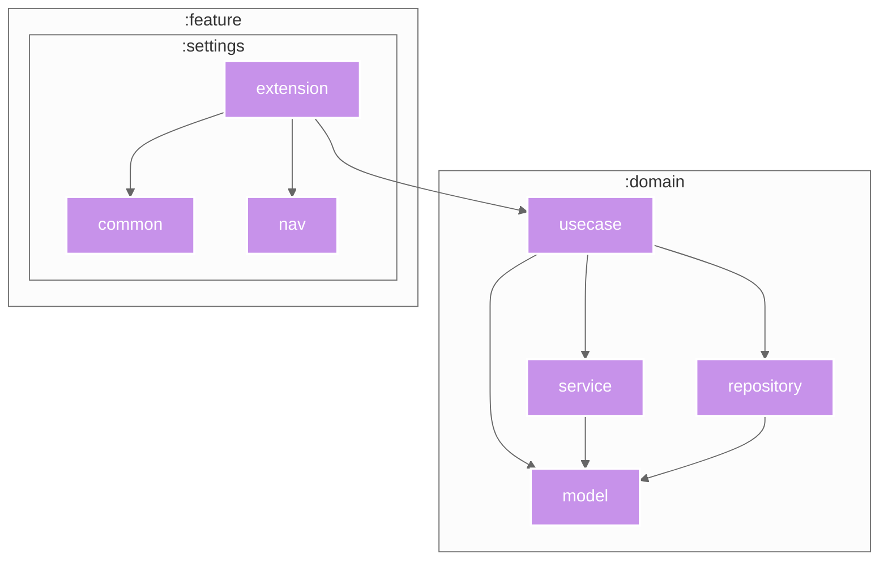

# :feature:settings:extension

## Module dependency graph

```mermaid
%%{
  init: {
    'theme': 'neutral'
  }
}%%

graph TB
  subgraph :domain
    :domain:usecase["usecase"]
    :domain:model["model"]
    :domain:repository["repository"]
    :domain:service["service"]
    :domain:service["service"]
    :domain:usecase["usecase"]
    :domain:repository["repository"]
  end
  subgraph :feature
    subgraph :settings
      :feature:settings:extension["extension"]
      :feature:settings:common["common"]
      :feature:settings:nav["nav"]
    end
  end

  :domain:usecase --> :domain:model
  :domain:usecase --> :domain:repository
  :domain:usecase --> :domain:service
  :domain:service --> :domain:model
  :feature:settings:extension --> :domain:usecase
  :feature:settings:extension --> :feature:settings:common
  :feature:settings:extension --> :feature:settings:nav
  :domain:repository --> :domain:model

classDef kotlin-multiplatform fill:#C792EA,stroke:#fff,stroke-width:2px,color:#fff;
class :domain:usecase kotlin-multiplatform
class :domain:model kotlin-multiplatform
class :domain:repository kotlin-multiplatform
class :domain:service kotlin-multiplatform
class :feature:settings:extension kotlin-multiplatform
class :feature:settings:common kotlin-multiplatform
class :feature:settings:nav kotlin-multiplatform

```