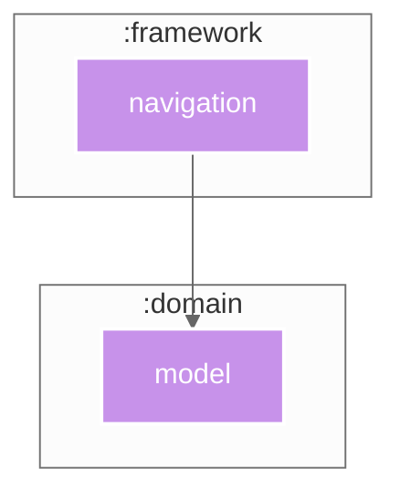

# :framework:navigation

## Module dependency graph

```mermaid
%%{
  init: {
    'theme': 'neutral'
  }
}%%

graph TB
  subgraph :framework
    :framework:navigation["navigation"]
  end
  subgraph :domain
    :domain:model["model"]
  end

  :framework:navigation --> :domain:model

classDef kotlin-multiplatform fill:#C792EA,stroke:#fff,stroke-width:2px,color:#fff;
class :framework:navigation kotlin-multiplatform
class :domain:model kotlin-multiplatform

```
